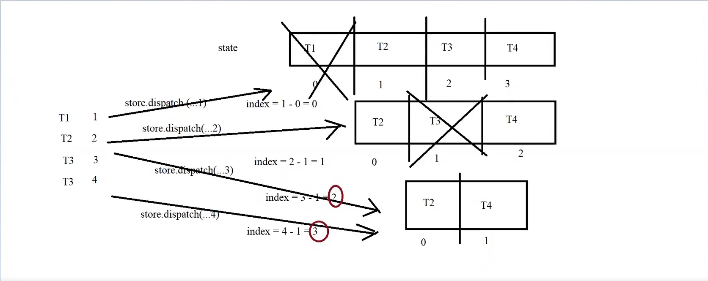

> Bug khi mà mình xóa thì cái state bị change rồi => mình xóa bị sai

```js
const deleteTodoList = document.querySelector(".delete-todolist");
deleteTodoList.onclick = function () {
  const olEl = document.querySelector("#view-todolist");
  const checkedEls = olEl.querySelectorAll("input[type=checkbox]:checked");
  for (const checkedEl of checkedEls) {
    let key = checkedEl.getAttribute("key");
    store.dispatch({ type: "remove", payload: key }); //khi mà mình xóa thì cái
    //state bị change rồi => mình xóa bị sai
    //những thằng check rồi thì xóa
  }
};
```



C1
Dùng cơ chế key

```js
[
  { key: 1527, name: Task1 },
  { key: 1927, name: Task2 },
];
```

để giữ lại thứ tự

> Dispatch 4 lần thì cái giao diện này sẽ lại cập nhật 4 lần
> Dispatch 1 lần thì giao diện của mình sẽ chỉ cập nhật lại 1 lần

```js
deleteTodoList.onclick = function () {
  const olEl = document.querySelector("#view-todolist");
  const checkedEls = olEl.querySelectorAll("input[type=checkbox]:checked");
  const keys = [];
  for (const checkedEl of checkedEls) {
    let key = checkedEl.getAttribute("key");
    //state bị change rồi => mình xóa bị sai
    //những thằng check rồi thì xóa
    keys.push(key);
  }
  store.dispatch({ type: "remove", payload: keys }); //khi mà mình xóa thì cái
};
```

```js
const todoListReducer = (state = initalState, action) => {
  //state là trạng thái hiện tại
  switch (action.type) {
    case "add":
      var newState = [...state]; //newState = state //ghi đè vào bộ nhớ ăn mày luôn
      newState.push(action.payload);
      return newState;
    case "remove":
      if (typeof action.payload == "number") {
        var newState = [...state]; //copy ra 1 cái state mới
        const key = action.payload; //danh sách của mình tính là 0 nhưng mà mình lưu là 1
        const index = key - 1; //danh sách tính từ 0
        newState.splice(index, 1);
        return newState;
      } else {
        var newState = [];
        const keyList = payload.key;
        for (let i = 0; i <= state.length - 1; i++) {
          const key = i + 1;
          if (keyList.include(key)) {
            newState.push(task);
          }
        }
        return newState;
      }
    default:
      return state;
  }
};
```
